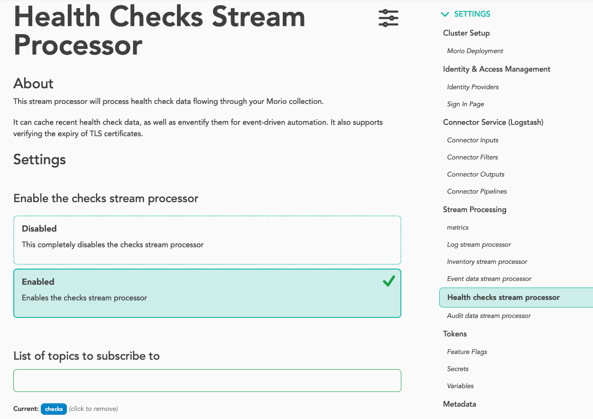
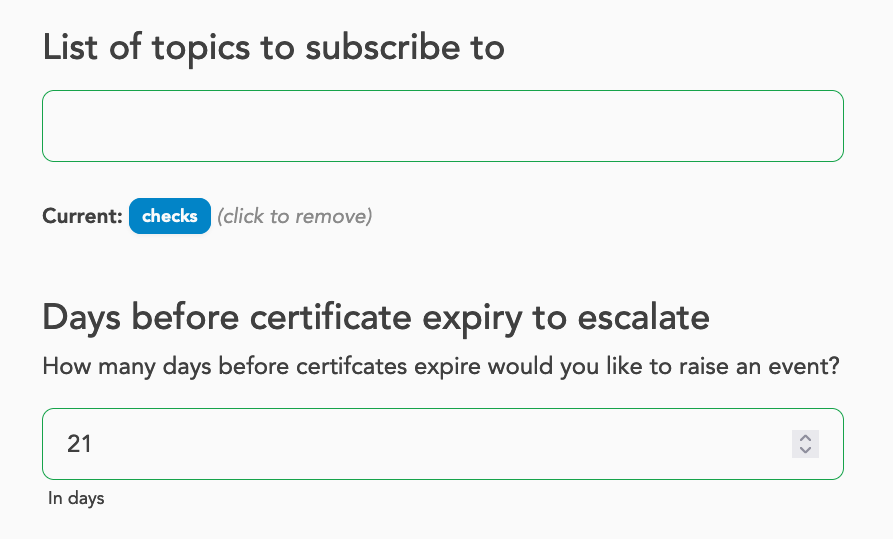

The _Tap service_ unlocks the power of stream processing inside Morio without
the complexity. It provides a low-code way to write your own stream processing
logic and have Morio run it for you.

:::tip Some JavaScript required

With Morio, you can _BYOBL_ and write your own stream processor in JavaScript.

If you are not familiar with JavaScript, it is a beginner-friendly language
and you do not need to master it to start creating valuable stream processing 
logic. Instead, you can start from our examples and build up from there, or
look at [the various stream processors on
MorioHub](https://github.com/certeu/moriohub/tree/develop/processors) for
inspiration.

If you prefer another language, you can always handle these aspects yourself
and [talk directly to Kafka](/docs/guides/features/stream-processing/kafka/).
:::


To create a stream processor for Morio, you need two things:

- Some **info** to declare how to integrate your stream processor
- A **function** that receives data from the stream and handles your business
  logic

Let's look at both in detail:

## The `info` object {#info}

Below is a minimal example of an `info` object for a stream processor:

```js showLineNumbers
export const info = {
  settings: {
    topics: ['logs']
  }
}
```

Our `info` objects holds a `settings` key. This is where we can define one
or more settings to control the behaviour of your stream processor.

### The `topics` setting is mandatory {#topics}

The only mandatory setting is `topics`, which holds a list of topics your
stream processor wants to subscribe to. This is the only information in
the `info` object that Morio needs to integrate your stream processor.

The `info` object can hold more information, but that is for the benefit of the
user, Morio only needs to know what topic(s) to subscribe to.

### Other `info` content

If you are writing a stream processor for your own use, the `topics` setting
may be all you need.  But if you are planning to share your stream processor
with the community through [MorioHub](https://github.com/certeu/moriohub) -- or
just want to reach a higher level of polish -- you can extend the `info` object
with more information. Specifically:

- You can add information for the benefit of the user -- like a description of
what the stream processor does
- You can add additional settings that the user can leverage to control how
  your stream processor behaves.

Here is an example from [our checks stream processor on
MorioHub](https://github.com/certeu/moriohub/blob/develop/processors/checks/index.mjs)
that adds both info and custom settings:

```js showLineNumbers
export const info = {
  title: 'Health checks stream processor',
  about: `This stream processor will process health check data flowing through your Morio collection.
It can cache recent health check data, as well as eventify them for event-driven automation.
It also supports verifying the expiry of TLS certificates.
`,
  settings: {
    topics: ['checks'],
    certificate_days: {
      dflt: 21,
      title: 'Days before certificate expiry to escalate',
      about: 'How many days before certificates expire would you like to raise an event?',
      labelBL: 'In days',
      type: 'number'
    }
  }
}
```

And here is a screenshot from this stream processor in the settings UI:



As you can see, this results in a more polished experience for the user
who now gets information about what this stream processor does.

We can also see that Morio will add a setting to disable (or enable) this
stream processor.  This setting is automatically injected for all stream
processors. While loaded stream processors are enabled by default, this allows
disabling them without having to unload them.

We can also see that our `topics` setting is made available. Since this setting
is present for all stream processors, you do not need to give it a title and so
on.
Things are different for the `certificate_days` setting which is a custom
setting that applies to this stream processor only.  Thanks to the info we
provided, Morio will present it in the settings wizard as shown in the
screenshot below:



### Further reading

Refer to [the stream processor reference documentation](#fixme) to learn about
all the various ways you can extend your stream processor with custom settings.


## The stream processor function

Now that we've learned how to inform Morio about how to integrate our stream
processor, it is time we get to the good stuff: actual stream processing.

The way it works is that Morio's tap service will subscribe to all topics you
specified in [the `topics` settings](#topics).
Every time a new message arrives in one of these topics, it will call a function you
provide with the data received from the stream and some helper tools too. Here
is a minimal example:

```js showLineNumbers
export default function (data, tools, topic) {
  // Do something here
}
```

We have tried to keep the boilerplate to a minimum: you merely need to define
a function and to make it the default export.  The function receives 3
parameters: [data](#data), [tools](#tools), and [topic](#topic).
Let's have a closer look at each one of these.

### data

The first parameter, `data`, holds the data received from the RedPanda/Kafka
topic.  As our stream processing function will be called for each message that
is received on the topic(s) we have subscribed to, `data` will hold one such
message parsed as JSON, so it will be structured as an object.

:::tip
Note that Morio uses the [Elastic Common
Schema](https://www.elastic.co/guide/en/ecs/current/index.html) so the data
should always be well structured.
:::

Below is an example from the `audit` topic to give you an idea of what to
expect, although the actual `data` will obviously be different for you.

```json
{
  "@timestamp": "2025-01-10T11:38:48.405Z",
  "@metadata": {
    "beat": "auditbeat",
    "type": "_doc",
    "version": "8.13.4",
    "_id": "lrMCUJQBLSvE28yaforY"
  },
  "service": {
    "type": "auditd"
  },
  "morio": {
    "module": "linux-system"
  },
  "ecs": {
    "version": "8.0.0"
  },
  "auditd": {
    "message_type": "user_login",
    "sequence": 433625,
    "result": "fail",
    "data": {
      "terminal": "sshd",
      "acct": "joostdecock",
      "op": "login"
    },
    "summary": {
      "actor": {
        "secondary": "joostdecock",
        "primary": "unset"
      },
      "object": {
        "primary": "sshd",
        "secondary": "10.1.222.96",
        "type": "user-session"
      },
      "how": "/usr/sbin/sshd"
    }
  },
  "related": {
    "user": [
      "joostdecock"
    ]
  },
  "event": {
    "outcome": "failure",
    "kind": "event",
    "type": [
      "start"
    ],
    "module": "auditd",
    "category": [
      "authentication"
    ],
    "action": "logged-in"
  },
  "user": {
    "effective": {
      "id": "1666",
      "name": "joostdecock"
    }
  },
  "process": {
    "pid": 1193419,
    "executable": "/usr/sbin/sshd"
  },
  "source": {
    "ip": "192.168.78.12"
  },
  "host": {
    "id": "003d04a1-0131-4789-bcca-375bb86dab6c",
    "name": "docs.infra.morio.it"
  },
  "network": {
    "direction": "ingress"
  }
}
```

### tools

The second parameter holds the `tools` object. As the name implies, this is a
helper object that provides you with various tools that you can leverage inside
your stream processor logic.

:::tip
Check out some of [the stream processors on
MorioHub](https://github.com/certeu/moriohub/tree/develop/processors) for
examples of how to use these tools.  
:::

Here's a brief overview of what is provided by tools; for a full list, please
refer to [the stream  processing reference documentation](#fixme).

- `tools.axios`: Holds an instance of [the `axios` HTTP client](https://www.npmjs.com/package/axios)
- `tools.get`: Holds a copy of [the `lodash.get` method](https://lodash.com/docs/4.17.15#get)
- `tools.set`: Holds a copy of [the `lodash.set` method](https://lodash.com/docs/4.17.15#set)
- `tools.unset`: Holds a copy of [the `lodash.unset` method](https://lodash.com/docs/4.17.15#unset)
- `tools.cache`: Holds various helpers to add data to the Morio cache
  - `tools.cache.audit`: Caches audit data
  - `tools.cache.event`: Caches event data
  - `tools.cache.healthcheck`: Caches health check data
  - `tools.cache.logline`: Caches log data
  - `tools.cache.metricset`: Caches metrics data
- `tools.clean`: A helper method to lowercase and trim strings
- `tools.inventory`: Helper methods to manage the Morio inventory
- `tools.ipaddr`: A copy of [the `ipaddr.js` library](https://www.npmjs.com/package/ipaddr.js) to wrangle IP addresses
- `tools.node`: A helper method for logging that sidesteps the potential logging snowball effect
- `tools.valkey`: An instance of [the `ioredis` Redis client](https://www.npmjs.com/package/ioredis) for low-level cache access
- `tools.create`: Helper methods to generate various types of data
  - `tools.create.context`: Creates a Morio context
  - `tools.create.hash`: Creates a hash
  - `tools.create.key`: Creates a Morio cache key
- `tools.extract`: Helper methods to generate various types of info from data received from RedPanda/Kafka
  - `tools.extract.by`: Extracts the agent name from the data
  - `tools.extract.check`: Extracts the full health check URL from the data
  - `tools.extract.host`: Extracts the host ID from the data
  - `tools.extract.id`: Extracts the message ID from the data
  - `tools.extract.metricset`: Extracts the (name of the) metric set from the data
  - `tools.extract.module`: Extracts the (name of the) Morio module from the data
- `tools.format`: Helper methods to format data
  - `tools.format.escape`: Escapes a string value for use in a URL query string
- `tools.log`: A logger object, an instance of the `pino` logger. Beware of the snowball effect when logging.
- `tools.time`: Various methods to deal with time data
  - `tools.time.ms2s`: Converts milliseconds to seconds
  - `tools.time.now`: Returns the current timestamp
  - `tools.time.when`: Gets the timestamp from the data
- `tools.produce`: Various methods to publish data to a RedPanda topic
  - `tools.produce.alarm`: Publish a message to the `alarms` topic
  - `tools.produce.event`: Publish a message to the `event` topic
  - `tools.produce.notification`: Publish a message to the `notifications` topic
  - `tools.produce.inventoryUpdate`: Publish a message to the `inventory` topic
- `tools.settings`: The running Morio settings, including the settings for the stream processor
- `tools.getSettings`: A helper method for easy access to the Morio settings
- `shortUuid`: A helper method to return the short version of a UUID

### topic

The third and final parameter, `topic`, holds the name of the topic that the `data`
was sourced from.  If your stream processor only subscribes to a single topic,
this information is not very useful; but if you have a stream processor that
subscribes to multiple topics -- like [our inventory stream
processor](https://github.com/certeu/moriohub/blob/develop/processors/inventory/index.mjs)
does -- this allows you to differentiate your logic based on the topic that the
message came from.

## Bundling your stream processor

To bundle your stream processor, create a folder, and inside it add an `index.mjs` file.
In this file, you define both your method and info object. Below is a full example - 
albeit that does nothing:


```js showLineNumbers title="example/index.mjs"
/*
 * A minimal Morio stream processor
 * This function will be called for every incoming message
 *
 * @param {object} data - The data from RedPanda
 * @param {obectt} tools - The tools object
 * @param {string} topic - The topic that the data came from
 */
export default function exampleStreamProcessor (data, tools, topic) {
  /*
   * Do something here
   * For now, this does nothing
   */
}

/*
 * This named export is used to pass info/settings
 */
export const info = {
  title: 'Example stream processor',
  about: `This stream processor does nothing, successfully.`
  settings: {
    topics: ['logs']
  }
}
```

A few things to note:

- We gave our function the name `exampleStreamProcessor`. This is not
  mandatory, but can help with debugging. Without a name, the function becomes
  a so-called anonymous function, and that can make it harder to debug.
- We added some comments so that we can understand what is happening just from
  reading the code
- We added `title` and `about` to our info object, as well as the `topics` we
  want to subscribe to.

## Loading your stream processor

Stream processors can be dynamically loaded by Morio. The way to do that is by
_preseeding_ them.

The first thing you have to do is make your stream processor available from a git repository. It can be a self-hosted repository, or a SaaS service like GitHub or GitLab, but it needs to be in a git repository that Morio can access.

Then update your preseed settings. Here is an example that loads all stream processors from MorioHub:

```yaml
preseed:
  git: 
    moriohub:
      url: "https://github.com/certeu/moriohub.git"
    processors: 
      - git:processors/**@moriohub
```

:::tip See the preseeding guide for more details
Refer to [the preseeding guide](/docs/guides/settings/preseed/) for all details
about preseeding stream processors and other settings.
:::

## Extending a stream processor

Stream processors can be further extended. To do so, create a `modules` folder
at the same level of your `index.mjs` file.

In the `modules` folder, one or more `.mjs` files can be placed. Morio will
automatically create a `modules/index.mjs` files that imports all the (default)
exports, and re-exports them.

The end result is that your stream processor can use this line to include this logic:

```js
import modules from "./modules/index.mjs"
```

This feature is especially powerful because you can load preseed these files in
the `modules` folder from various locations.

For example, [the metrics stream processor on
MorioHub](https://github.com/certeu/moriohub/tree/develop/processors/metrics/modules)
used this mechanism to allow logic for how to cache metrics for different Morio
modules.

Give that metrics data is highly specific -- the metrics for disk usage on
Linux or CPU use on Windows look very different -- so the stream processor
itself provides the high-level logic for caching metrics, but the decision of
what data exactly needs to be cached is left to the module-specific files.

This not only makes the code modular, it also allows people who are running
custom Morio modules to extend the existing metrics stream processor with the
logic to handle caching of these custom metrics modules.

:::tip
Have a look at [the source code of the metrics
processor](https://github.com/certeu/moriohub/blob/develop/processors/metrics/index.mjs)
for an example.
:::

## Beware of the logging snowball effect

One thing to avoid inside a stream processor function is to log data.
Especially when you are processing log data with that stream processor.

We do provide a logger object in the tools object, because you may have a
specific use-case where it is OK to log inside a stream processor. But you
should be aware that this is often a bad idea that will quickly spiral out of
control:

- Imagine you have a stream processor that is processing log data.
- When that stream processor logs themselves, those logs will be picked up by the local Morio client running on the Morio collected, and will end up in the `logs` topic
- From there they will be picked up by our stream processor, which will generate more logs... and round and round we go!

This creates a feedback loop, or snowball effect, where the logs generated by
the stream processor get picked up again by the same stream processor,
ever-increasing the amount of log data flowing through the system.

For this reason, use the `tools.note` helper to log data inside the stream
processor. These logs will be added to the Morio cache and made available
through the UI and API, thus avoiding this feedback loop.

