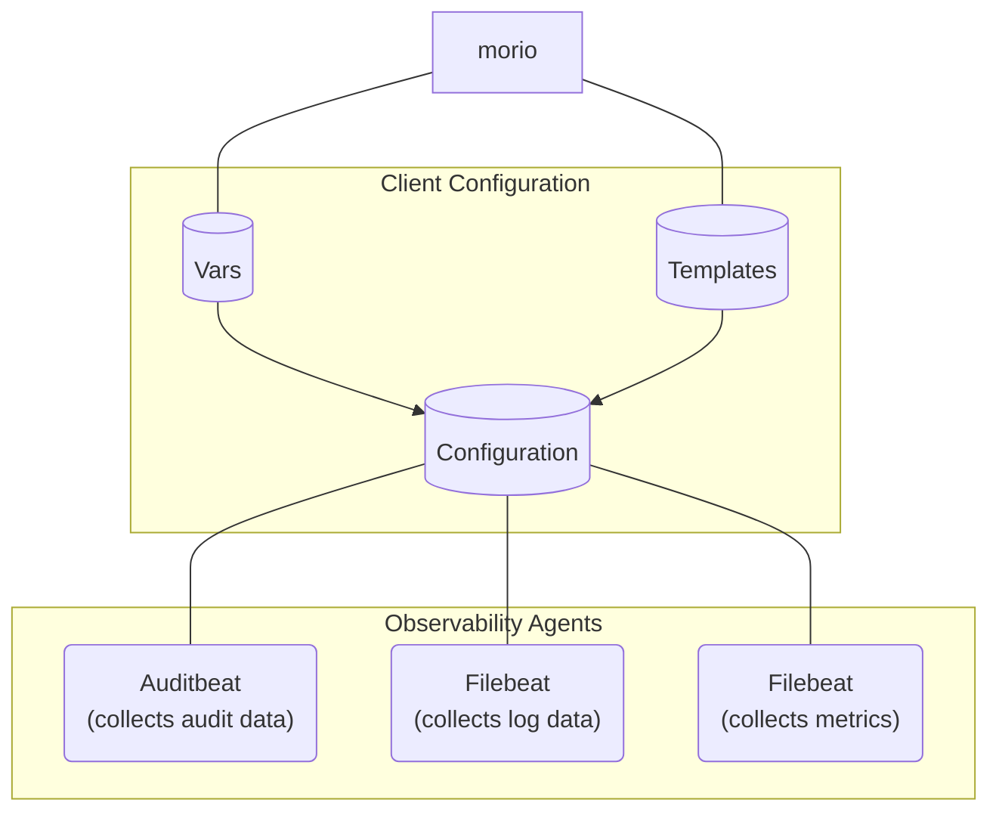

FIXME

## About the Morio client

Before we dive into the configuration of the Morio client, let us take a moment to
ensure we have a good mental model of what the client is and does.

### One client, multiple observability agents



The Morio client bundles various observability agents, based on the [Beats
framework](https://www.elastic.co/beats) by Elastic.
When you install the Morio client, the various Beats agents will be installed on
your system as well, and you will be able to interact with them directly if you so wish.

:::tip Already using Beats?
If you are already using Beats on a system, you can still install the Morio
client.  We make sure to not use any of the various Beats default configuration
or data locations. So the Morio client can run side by side with your existing
use of Beats agents.
:::


### Templates and vars

As Morio uses several specialised agents under the hood, we have further
facilitated the management of the client's configuration through a higher 
configuration abstraction level that leverages _templates_ and _vars_.

#### Morio client templates

A Morio client template is a modular piece of agent configuration. It can
describe what log files to collect (for Filebeat), what files to watch for
changes (for Auditbeat), or what metrics to collect (for Metricbeat), and 
so on.
As we like to [keep things simple](/docs/guides/goals/#design-goals), we
_bundle_ templates for the various agents into a single _module_ by naming
convention. Then, the Morio client can enable or disable such a _module_,
which means that rather than having to manage 3 individual agents, you have
one single integrated configuration.

We maintain a curated list of templates in [the Morio template
hub](https://github.com/certeu/morio-templates). We consider this a communal 
effort to take the drudge out of configuring observability.
For example, why does everyone running an NGINX web server have to come up
with their configuration? They shouldn't, not when you can use a template
instead, and just enable the `nginx` module (as an example).

If at this point you are thinking _But you don't know where I store my NGINX
logs!_, then thank you for providing the perfect segue to our next point.

#### Morio client vars

Invariably, no template can work out of the box for everyone. 
Perhaps logs are stored in a different location or under a different format.
Maybe on your production systems you are looking to collect more metrics than
on your testing systems, and so on.

That's where Morio client vars come in. Template authors can use a variable
rather than hard-code these settings. Furthermore, they can define a default
for the variable. If that default works for you, great. If not, you merely need
to set the variable to override the default.

You can set these variables with the Morio client, or you can use any
automation tool you like because these vars are just files.  The filename is
the name of the variable, and its contents its value. Because
you know, [we like to keep it simple](/docs/guides/goals/#design-goals).

## The `morio` binary

The Morio client will install the `morio` binary on your system.
In other words, after installing the client you can run:

```
morio
```

If you do so, it will show you the following help:

```
morio: The Morio client

This client wraps different agents that each gather one type
of observability data and ship it to a Morio collector.

Use this to manage the various agents and their configuration.

Usage:
  morio [command]

Available Commands:
  audit       Invoke the audit agent
  completion  Generate the autocompletion script for the specified shell
  help        Help about any command
  init        Initialise the Morio client
  logs        Invoke the logs agent
  metrics     Invoke the metrics agent
  modules     Manage modules
  restart     Restart agents
  start       Start agents
  status      Shows agents status
  stop        Stop agents
  template    Template out the agents configuration
  vars        Manage configuration template variables
  version     Morio client version

Flags:
  -h, --help      help for morio
  -v, --version   version for morio

Use "morio [command] --help" for more information about a command.
```

As you can see, there's a number of commands. We won't go through all of them
in detail (use the inline help for that) but we'll cover the basics.

### morio init

You should run `morio init` on a freshly installed Morio client. It will
generate a UUID that will be used to uniquely identity the client. This is
important to ensure data can be tied to the client regardless of hostname
changes and so on.

Run `morio init -h` to get the inline help:

```
This will initialise a new Morio client installation
by generating a unique UUID for the client and run some other
housekeeping chores.

This command is idempotent. In other words, you can run it more
than once without side-effects.

Usage:
  morio init [flags]

Flags:
  -h, --help   help for init
```

### morio status/start/restart/stop

This allows you to start/stop/restart or check the status of all agents, or of
a specific agent you specify.  It's a convenience method that allows you to
control all agents as one.

Run any of the commands with the `-h` flag to get the help. For example,
running `morio status -h`:

```
Shows the status of all agents, or the one you pass it

Usage:
  morio status [flags]

Examples:
  Show the status of all agents:
    morio status

  Show the status of a specific agent:
    morio status logs

Flags:
  -h, --help   help for status
```


### morio vars

This allows you to manage the Morio client vars. Here's the inline help:

```
The 'morio vars' command allows you to manage
template variables for the Morio client configuration.

The Morio client wraps various beats agents that all have their own
configuration and modules to manage. Morio ships these as templates
that take various variables (vars). This command allows you to manage
these vars.

To combine the configuration templates and your vars into an actual
configuration, run 'morio template'.

Usage:
  morio vars [command]

Available Commands:
  clear       Set a var to an empty string
  disable     Set a var to false
  enable      Set a var to true
  export      Exports vars to JSON
  get         Get the value of a var
  import      Import vars from a JSON file
  rm          Remove a (custom) variable
  set         Set the value of a var

Flags:
  -h, --help   help for vars

Use "morio vars [command] --help" for more information about a command.
```

There's a bunch of subcommands here. Keep in mind that vars are stored in files
in the Morio config folder.

### morio template

Run this command to template out the agents' configuration.

You should run this every time you change a variable or template. It's ok to run this more than once, no harm will come from it.

This command takes no arguments, running `morio template -h` tells you as much:

```
Templates out the configuration for the different agents.

Usage:
  morio template [flags]

Examples:
  morio template

Flags:
  -h, --help   help for template
```

:::note
You need to run `sudo morio template` since the Morio configuration is only
writable by the root user.
:::

### morio audit/logs/metrics

Running any of these commands will pass-through your command options to the
respective agent. It has the benefit that the agent will be invoked with the
Morio-specific configuration, which won't be the case if you invoke it
directly.

For example, running `morio audit -h` gives you the inline help of Auditbeat:

```
Usage:
  auditbeat [flags]
  auditbeat [command]

Available Commands:
  export      Export current config or index template
  help        Help about any command
  keystore    Manage secrets keystore
  run         Run auditbeat
  setup       Setup index template, dashboards and ML jobs
  show        Show modules information
  test        Test config
  version     Show current version info

Flags:
  -E, --E setting=value              Configuration overwrite
  -N, --N                            Disable actual publishing for testing
  -c, --c string                     Configuration file, relative to path.config (default "auditbeat.yml")
      --cpuprofile string            Write cpu profile to file
  -d, --d string                     Enable certain debug selectors
  -e, --e                            Log to stderr and disable syslog/file output
      --environment environmentVar   set environment being ran in (default default)
  -h, --help                         help for auditbeat
      --httpprof string              Start pprof http server
      --memprofile string            Write memory profile to this file
      --path.config string           Configuration path (default "")
      --path.data string             Data path (default "")
      --path.home string             Home path (default "")
      --path.logs string             Logs path (default "")
      --plugin pluginList            Load additional plugins
      --strict.perms                 Strict permission checking on config files (default true)
  -v, --v                            Log at INFO level

Use "auditbeat [command] --help" for more information about a command.
```

You can use this every time you need low-level access to one of the agents.

## Client configuration folder

All the high-level templates and vars work is mapped to file operations in the Morio client configuration folder.
You will find the following folders there:

| Agent | Configuration Templates      | Configuration files | Description |
| --------------- | ---------------------------- | ------------------- | ----------- |
| Auditbeat       | `audit/module-templates.d`   | `audit/modules.d`   | [Auditbeat module settings][auditmod] |
| Auditbeat       | `audit/rule-templates.d`     | `audit/rules.d`     | [auditd rules][auditrules] (linux only) |
| Filebeat        | `logs/input-templates.d`     | `logs/inputs.d`     | [Filebeat inputs][logsinputs] |
| Filebeat        | `logs/module-templates.d`    | `logs/modules.d`    | [Filebeat module settings][logsinputs] |
| Metricbeat      | `metrics/module-templates.d` | `metrics/modules.d` | [Metricbeat module settings][metricsmod] |
| -               | `default.vars.d`             |                     | Default vars as defined by template authors |
| -               | `vars.d`             |                     | vars that are specific to the local system |


If you want to manage vars manually, you can do so by writing/updating the
files in the `vars.d` folder.  If you would like to bypass Morio's
templates/vars system altogether and configure the various agents yourself, you
can add your configuration as `.yml` files in the various configuration
folders. The Morio client only uses `.yaml` files, and will ignore all `.yml`
files.

[auditmod]: https://www.elastic.co/guide/en/beats/auditbeat/master/auditbeat-modules.html
[auditrules]: https://www.elastic.co/guide/en/beats/auditbeat/master/auditbeat-module-auditd.html#audit-rules
[logsinputs]: https://www.elastic.co/guide/en/beats/filebeat/current/configuration-filebeat-options.html
[logsmod]: https://www.elastic.co/guide/en/beats/filebeat/current/configuration-filebeat-modules.html
[metricsmod]: https://www.elastic.co/guide/en/beats/metricbeat/current/configuration-metricbeat.html

