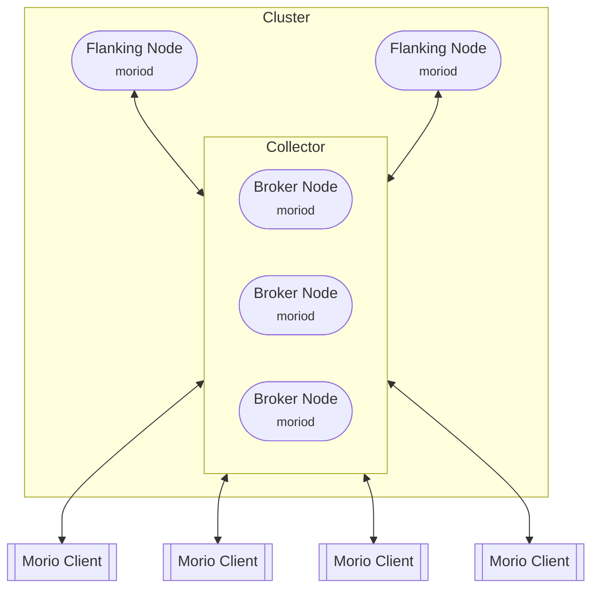

```mermaid
flowchart TD
    subgraph Cluster
        subgraph Collector
            broker1([Broker Node<br /><small>moriod</small>])
            broker2([Broker Node<br /><small>moriod</small>])
            broker3([Broker Node<br /><small>moriod</small>])
        end
        flanking1([Flanking Node<br /><small>moriod</small>])
        flanking2([Flanking Node<br /><small>moriod</small>])
    end
    Collector <--> client1[[Morio Client]]
    Collector <--> client2[[Morio Client]]
    Collector <--> client3[[Morio Client]]
    Collector <--> client4[[Morio Client]]

    flanking1 <--> Collector
    flanking2 <--> Collector
```      

